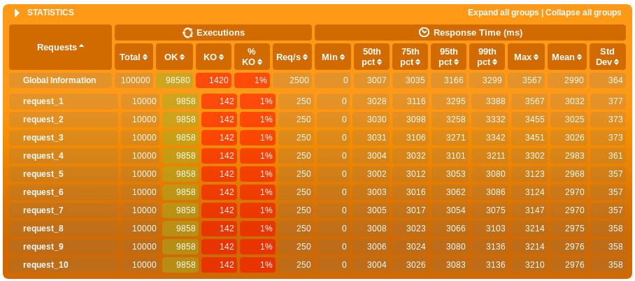

= Benchmarking Go/Mux vs NodeJS/Express

== Test purpose

This benchmark aims to compare Go/Mux and NodeJS/Express performances.

To do so, we have two implementations of the following HTTP REST API.

.GET /:value
. server waits asynchronously for 3 seconds (to simulate an heavy processing)
. server returns :value

=== Go/Mux

Go implementation can be found in link:server/golang[server/golang/] directory.

=== NodeJS/Express

NodeJS implementation can be found in link:server/nodejs[server/nodejs/] directory.

== Stress test implementation

We use link:https://gatling.io/[Gatling] to perform stress tests.

Implemented test runs 10 000 clients. Each one performs 10 successive requests.

Test implementation can be found in link:bench/simulations/FloodSimulation.scala[FloodSimulation.scala].

== Running tests

=== NodeJS

To run tests, launch the following commands in two separate terminals.

.Terminal 1
[sh]
```
$ ./run_nodejs_server.sh
```
.Terminal 2
[sh]
```
$ ./run_bench.sh nodejs
```

Test report end up here `reports/nodejs/floodsimulation-XXXX/index.html`.

=== Golang

To run tests, launch the following commands in two separate terminals.

.Terminal 1
[sh]
```
$ ./run_golang_server.sh
```
.Terminal 2
[sh]
```
$ ./run_bench.sh golang
```

Test report end up here `reports/golang/floodsimulation-XXXX/index.html`.

== Benchmark report

=== Hardware 
Tests have been run on a computer with the following specs.

.CPU
```
$ lscpu
Architecture :                          x86_64
Mode(s) opératoire(s) des processeurs : 32-bit, 64-bit
Boutisme :                              Little Endian
Processeur(s) :                         4
Liste de processeur(s) en ligne :       0-3
Thread(s) par cœur :                    2
Cœur(s) par socket :                    2
Socket(s) :                             1
Nœud(s) NUMA :                          1
Identifiant constructeur :              GenuineIntel
Famille de processeur :                 6
Modèle :                                42
Nom de modèle :                         Intel(R) Core(TM) i5-2520M CPU @ 2.50GHz
Révision :                              7
Vitesse du processeur en MHz :          1827.457
Vitesse maximale du processeur en MHz : 3200,0000
Vitesse minimale du processeur en MHz : 800,0000
BogoMIPS :                              4990.69
Virtualisation :                        VT-x
Cache L1d :                             32K
Cache L1i :                             32K
Cache L2 :                              256K
Cache L3 :                              3072K
Nœud NUMA 0 de processeur(s) :          0-3
Drapaux :                               fpu vme de pse tsc msr pae mce cx8 apic sep mtrr pge mca cmov pat pse36 clflush dts acpi mmx fxsr sse sse2 ss ht tm pbe syscall nx rdtscp lm constant_tsc arch_perfmon pebs bts rep_good nopl xtopology nonstop_tsc cpuid aperfmperf pni pclmulqdq dtes64 monitor ds_cpl vmx smx est tm2 ssse3 cx16 xtpr pdcm pcid sse4_1 sse4_2 x2apic popcnt tsc_deadline_timer aes xsave avx lahf_lm epb pti tpr_shadow vnmi flexpriority ept vpid xsaveopt dtherm ida arat pln pts
```

.Kernel
```
$ uname -mros
Linux 4.17.6-1-ARCH x86_64 GNU/Linux
```

=== Results

Here are the benchmark results :

.Go/Mux


.NodeJS/Express

